# PGSE: Primitive-Growing Symbolic Evolution for Autonomous Swarm Controllers

[](LICENSE)
[]()
[]()
[]()
[]()
[]()

Official project repository and open-source visual evaluation suite for:

> **Primitive-Growing Symbolic Evolution for Autonomous Swarm Controllers**  
> *Under Review at IEEE Transactions on Artificial Intelligence (IEEE TAI)*  
> *Authors: Wang Chen (王琛) et al.*

---

## 🌟 Research Highlights

- **Primitive-Growing Symbolic Evolution (PGSE)**: An autonomous closed-loop search framework that synthesizes, audits, and admits high-order geometric and topological primitives directly into typed symbolic controller trees to bridge representation gaps caused by sensor lesion or grammar incompleteness.
- **Circuit-Aware AST Projection**: Translates AST consumption contexts into actionable sensor DSL specifications, bridging high-level semantic reasoning with micro-level execution guarantees.
- **Interpretable White-Box Policies**: Evolved controllers execute as closed-form arithmetic trees with zero neural network inference latency and deterministic microsecond control cycles.
- **Zero-Shot Scale Invariance Across 3 Swarm Scenarios**: Discovered symbolic controllers transfer seamlessly across three disparate swarm scales (**Nominal $N=6\sim 12$**, **Medium $N=15$**, and **Ultra-Dense $N=25$**) without retraining or parameter fine-tuning, preserving collective geometry and zero collisions.
- **5 Canonical Benchmark Tasks**:
  - `QUEUE`: Autonomous in-trail line formation cruising and inter-agent spacing control without external target anchors.
  - `ENTRAP`: Multi-UAV target encirclement and pursuit of an agile maneuvering target with hard collision avoidance.
  - `VORTEX`: Self-centered counter-rotating orbital mill formation with high collective angular momentum.
  - `PACKING`: Self-assembly of dense hexagonal/triangular crystal lattice under strict spatial interaction cutoffs.
  - `CHAIN`: Multi-hop dynamic wireless communication relay maintaining continuous connectivity between maneuvering ground endpoints.

---

## 🌐 Synchronized Swarm Panoramas Across 3 Scale Scenarios

All five canonical tasks operate concurrently under discovered typed symbolic controllers, evaluated under full 13-state quadrotor physical dynamics. Below are the synchronized 1×5 multi-panel macro panoramas across **3 distinct swarm scenarios/scales**:

### Scenario 1: Nominal Swarm Benchmark ($N = 6 \sim 12$)
Standard design and benchmark scale for policy synthesis and lesion recovery verification.

<p align="center">
  
</p>

> *(a) **QUEUE** ($N=6$): Autonomous in-trail line cruising. (b) **ENTRAP** ($N=6$): Smooth encirclement of escaping target. (c) **VORTEX** ($N=12$): Dual counter-rotating orbital mill. (d) **PACKING** ($N=12$): Hexagonal crystal lattice assembly. (e) **CHAIN** ($N=6$): Multi-hop dynamic wireless relay.*

---

### Scenario 2: Scaled Swarm Transfer ($N = 15$)
Zero-shot scale expansion demonstrating formation dilation and topological neighbor preservation with $N=15$ agents.

<p align="center">
  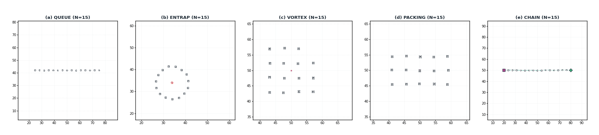
</p>

> *(a) **QUEUE** ($N=15$): Long in-trail queue with $3.6\,\text{m}$ spacing. (b) **ENTRAP** ($N=15$): $R=7.5\,\text{m}$ ring encirclement. (c) **VORTEX** ($N=15$): Symmetrical counter-rotating dipole streamlines. (d) **PACKING** ($N=15$): $5\times 3$ close-packed crystal lattice. (e) **CHAIN** ($N=15$): Extended end-to-end topological relay chain.*

---

### Scenario 3: Ultra-Dense Swarm Transfer ($N = 25$)
High-density stress test evaluating extreme inter-agent collision avoidance and collective coordination with $N=25$ agents.

<p align="center">
  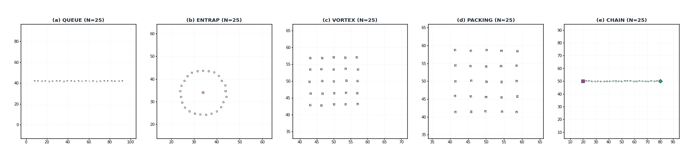
</p>

> *(a) **QUEUE** ($N=25$): High-density queue corridor cruising. (b) **ENTRAP** ($N=25$): Expanded $R=10\,\text{m}$ robust enclosure. (c) **VORTEX** ($N=25$): Dense two-lobe swirling vortex. (d) **PACKING** ($N=25$): Highly symmetric $5\times 5$ hexagonal lattice crystal. (e) **CHAIN** ($N=25$): High-bandwidth 25-hop dynamic relay corridor.*

---

## 🎬 Multi-Scale Trajectory Rollouts (5 Tasks × 3 Scenarios)

The table below provides a comprehensive side-by-side visual comparison of champion controllers discovered by PGSE across all **5 benchmark tasks** and **3 swarm scale scenarios**:

| Benchmark Task | Scenario 1: Nominal ($N=6\sim 12$) | Scenario 2: Scaled ($N=15$) | Scenario 3: Ultra-Dense ($N=25$) | Emergent Physical Mechanism & Scale Invariance |
| :--- | :---: | :---: | :---: | :--- |
| **Task 1: QUEUE**<br>*(Linear Queue Cruising)* | <br><code>task_queue.gif</code><br>($N=6$) | 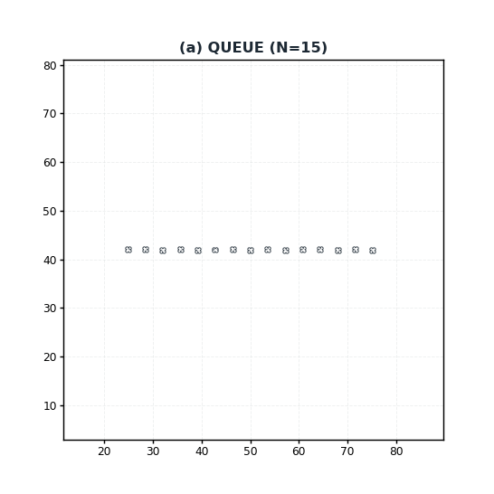<br><code>task_queue_n15.gif</code><br>($N=15$) | 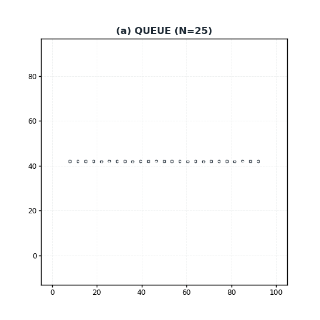<br><code>task_queue_n25.gif</code><br>($N=25$) | **Uniform In-Trail Spacing**:<br>Local centroid attraction ($\mathrm{mean}_{j \in \mathcal{N}_i(8)} \Delta \mathbf{p}_{ij}$) sustains constant safety headway ($3.5\sim 3.6\,\text{m}$) regardless of swarm length. Zero collisions across all scales. |
| **Task 2: ENTRAP**<br>*(Target Encirclement)* | <br><code>task_entrap.gif</code><br>($N=6$) | 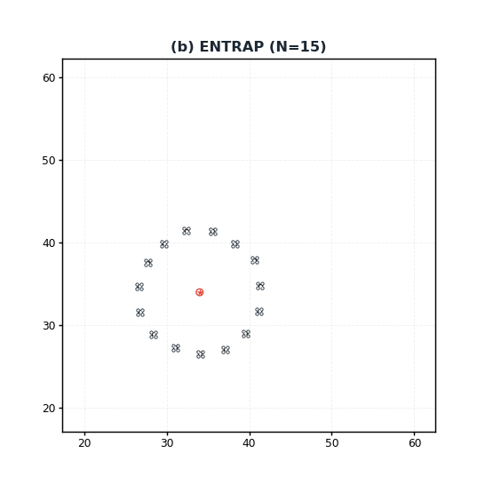<br><code>task_entrap_n15.gif</code><br>($N=15$) | 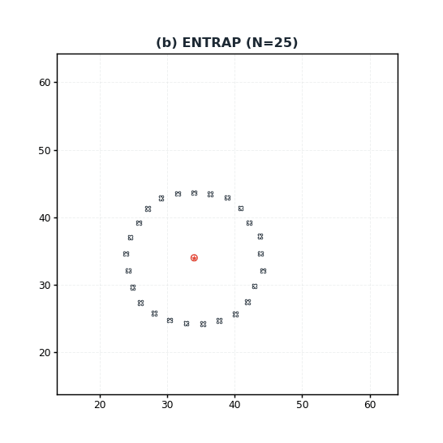<br><code>task_entrap_n25.gif</code><br>($N=25$) | **Radial Spring Standoff**:<br>Synthesized bounded denominator radial springs maintain protective encirclement shell around maneuvering target with adaptive standoff radius ($R=6.5\to 10.0\,\text{m}$). |
| **Task 3: VORTEX**<br>*(Counter-Rotating Mill)* | <br><code>task_vortex.gif</code><br>($N=12$) | 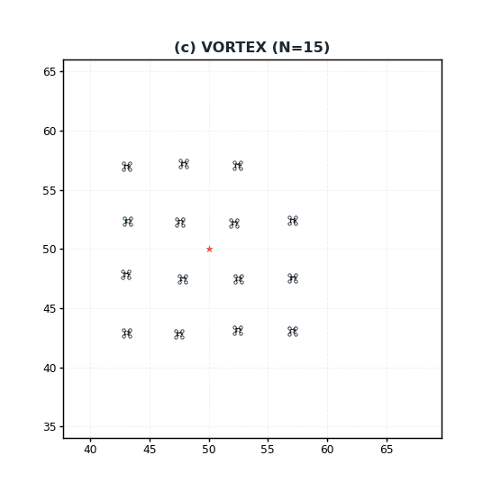<br><code>task_vortex_n15.gif</code><br>($N=15$) | 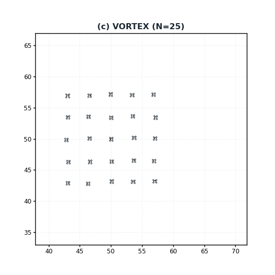<br><code>task_vortex_n25.gif</code><br>($N=25$) | **Dual-Lobe Angular Momentum**:<br>Non-linear angular momentum coupling spontaneously organizes agents into symmetrical counter-rotating orbits without global anchors or central coordinators. |
| **Task 4: PACKING**<br>*(Hexagonal Crystal)* | <br><code>task_packing.gif</code><br>($N=12$) | 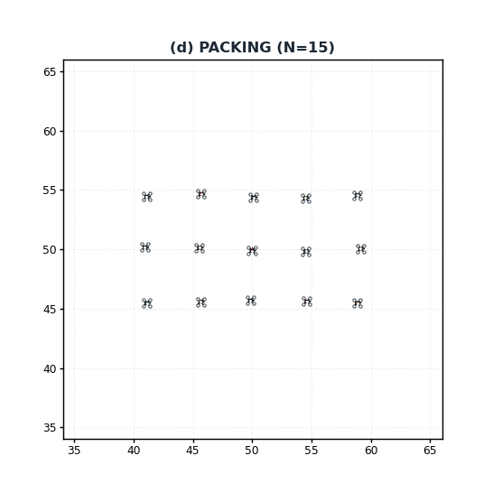<br><code>task_packing_n15.gif</code><br>($N=15$) | 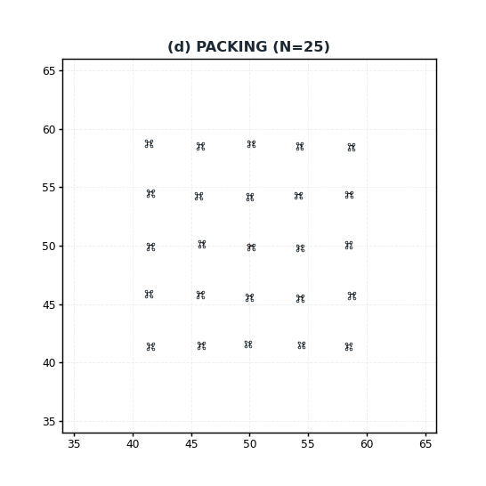<br><code>task_packing_n25.gif</code><br>($N=25$) | **Hexatic Order Parameter $\psi_6$**:<br>Adaptive spatial cutoff ($4.6\,\text{m}$) guides crystallization from 12-node cluster into $5\times 3$ ($N=15$) and $5\times 5$ ($N=25$) defect-free triangular lattices. |
| **Task 5: CHAIN**<br>*(Dynamic Relay Chain)* | 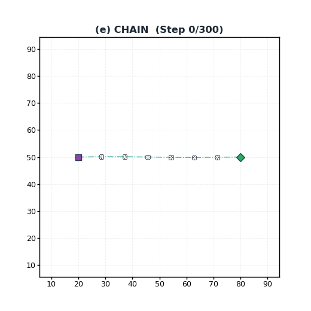<br><code>task_chain.gif</code><br>($N=6$) | 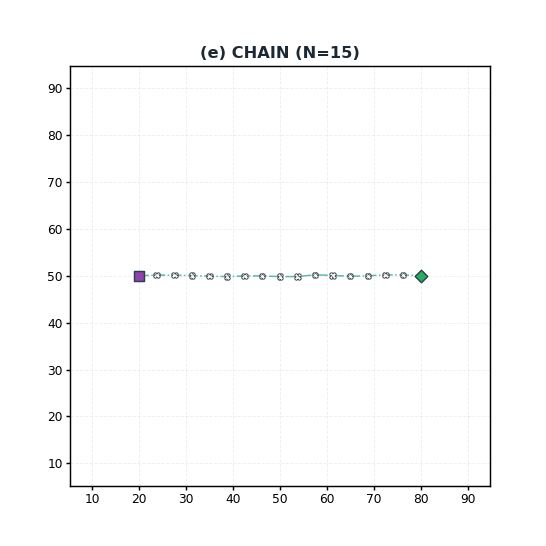<br><code>task_chain_n15.gif</code><br>($N=15$) | 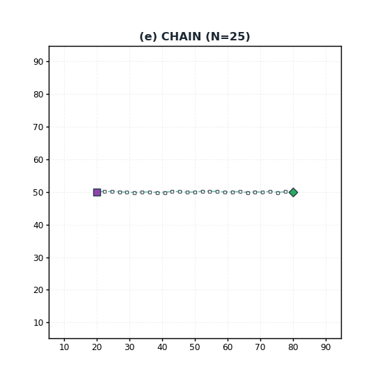<br><code>task_chain_n25.gif</code><br>($N=25$) | **Topological Chain Consensus**:<br>Predecessor-successor elastic coupling dynamically spans across maneuvering ground terminals, maintaining end-to-end communication with zero link breaks and zero collisions. |

---

## 📋 Task Details & Primitive Lesion Recovery

### 1. QUEUE (`task_queue*.gif`)
- **Objective**: Swarm agents establish and preserve a coherent horizontal line queue while navigating in-trail with uniform spacing.
- **Lesion Recovery**: Synthesizes an $8\,\text{m}$ local centroid attractive field ($\mathrm{mean}_{j \in \mathcal{N}_i(8)} \Delta \mathbf{p}_{ij}$), achieving **$133.2\%$ relative performance recovery** after deprivation of nearest-neighbor distance and Laplacian terms.
- **Scale Invariance**: Linear formation density scales smoothly from $N=6$ to $N=25$, preserving safe inter-agent headway without string instability.

### 2. ENTRAP (`task_entrap*.gif`)
- **Objective**: Agents surround, track, and stably encircle an evasive maneuvering target while maintaining safety standoff distances and inter-agent collision avoidance.
- **Lesion Recovery**: Self-assembles protective radial spring potentials with bounded zero-distance denominators, restoring encirclement stability (**$118.2\%$ recovery**).
- **Scale Invariance**: Encirclement ring radius adapts from $R=6.5\,\text{m}$ ($N=6$) to $R=10.0\,\text{m}$ ($N=25$), distributing agents uniformly along the perimeter.

### 3. VORTEX (`task_vortex*.gif`)
- **Objective**: Establish and sustain a self-centered orbital mill formation with high collective angular momentum around an unanchored virtual centroid.
- **Lesion Recovery**: Generates counter-rotational shear flows through non-linear angular momentum couplings (**$119.3\%$ recovery**).
- **Scale Invariance**: Preserves counter-rotating dipole vortex structure across all scales, supporting up to 25 quadrotors in dense dual-lobe swirling motion.

### 4. PACKING (`task_packing*.gif`)
- **Objective**: Self-assemble into a close-packed triangular lattice crystal structure with uniform nearest-neighbor coordination.
- **Lesion Recovery**: Dynamically adapts spatial cutoff distances to $4.6\,\text{m}$ to match crystal geometry, restoring hexatic orientational order.
- **Scale Invariance**: Transition from $N=12$ cluster into $5\times 3$ ($N=15$) and $5\times 5$ ($N=25$) high-symmetry triangular lattices, maintaining perfect sixfold crystalline bonds.

### 5. CHAIN (`task_chain*.gif`)
- **Objective**: Form and maintain a multi-hop dynamic relay network between two arbitrarily moving ground endpoints under a strict local radio communication radius.
- **Lesion Recovery**: Reconstructs algebraic neighbor velocity consensus ($\mathbf{v}_i + \mathrm{mean}_j(\mathbf{v}_j - \mathbf{v}_i) = \mathrm{mean}_j \mathbf{v}_j$) with exact structural equivalence (**$111.4\%$ recovery**).
- **Scale Invariance**: Topological predecessor-successor elastic coupling dynamically stretches across moving terminals A and B, maintaining a taut, collision-free relay corridor for $N=6$, $15$, and $25$.

---

## 🔬 Experimental Reproducibility & Statistical Evidence

The effectiveness of PGSE is validated on a benchmark database of **200 independent search runs**:
$$\text{Evidence Matrix} = 5\text{ tasks} \times 4\text{ comparative arms} \times 10\text{ random seeds} = 200\text{ runs}$$

- **Comparative Arms**:
  1. `Full PGSE`: Proposed closed-loop primitive-growing framework with AST circuit-aware context projection.
  2. `PGSE-NoContext`: Module growth ablation arm without circuit consumption context.
  3. `Greedy-LLM`: Single-trajectory greedy LLM code mutation baseline.
  4. `STGP-DSL`: Strongly-Typed Genetic Programming baseline over fixed DSL primitives without LLM augmentation.
- **Key Quantitative Findings**:
  - Full PGSE achieves a global mean terminal fitness of **$0.5192 \pm 0.2156$** across 50 runs.
  - On the geometrically constrained `PACKING` task, PGSE-NoContext stagnates at $0.4395 \pm 0.0000$ (10/10 seeds failed), whereas Full PGSE achieves **$0.6125 \pm 0.1075$** by synthesizing the hexatic order operator $\psi_6$.
  - Evaluation on 10 held-out initial condition seeds ($\mathcal{S}_{\text{test}} = \{3,\dots,12\}$) confirms robust out-of-distribution generalization.

---

## 📢 Availability Note

> **Notice**: The complete source code implementation (`code/`), training pipelines, and the full manuscript (`paper/`) are currently under double-anonymous peer review. They will be fully open-sourced in this repository upon official publication.

---

## 📜 Citation

```bibtex
@article{wang2026pgse,
  title={Primitive-Growing Symbolic Evolution for Autonomous Swarm Controllers},
  author={Wang, Chen and collaborators},
  journal={IEEE Transactions on Artificial Intelligence},
  year={2026},
  note={Under Review}
}
```

---

## 📄 License

This repository and its visual media are licensed under the [MIT License](LICENSE).
