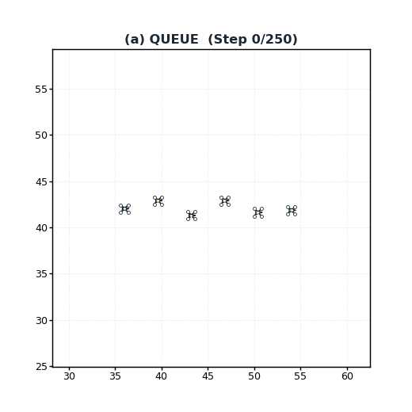
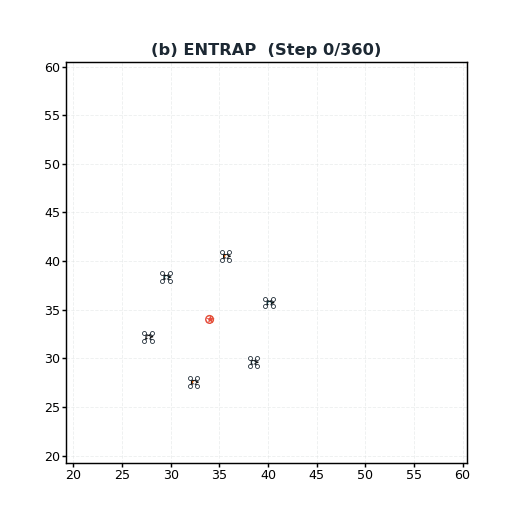
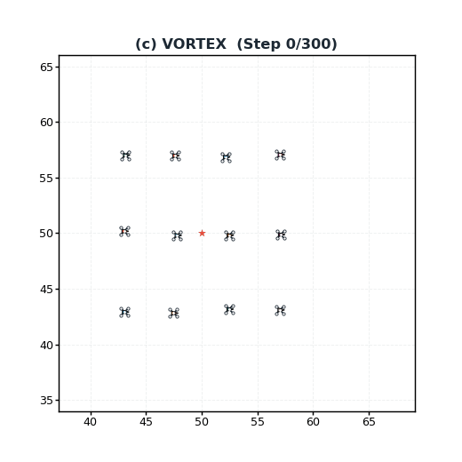
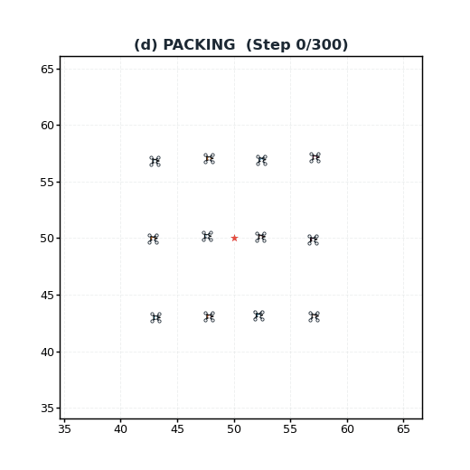
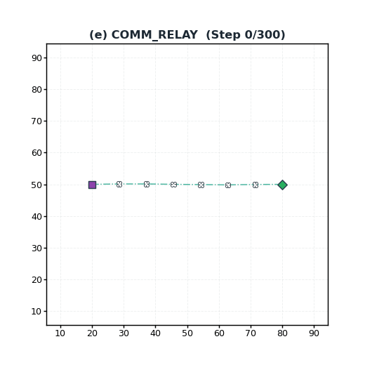
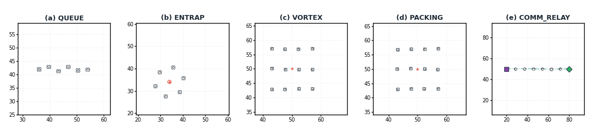
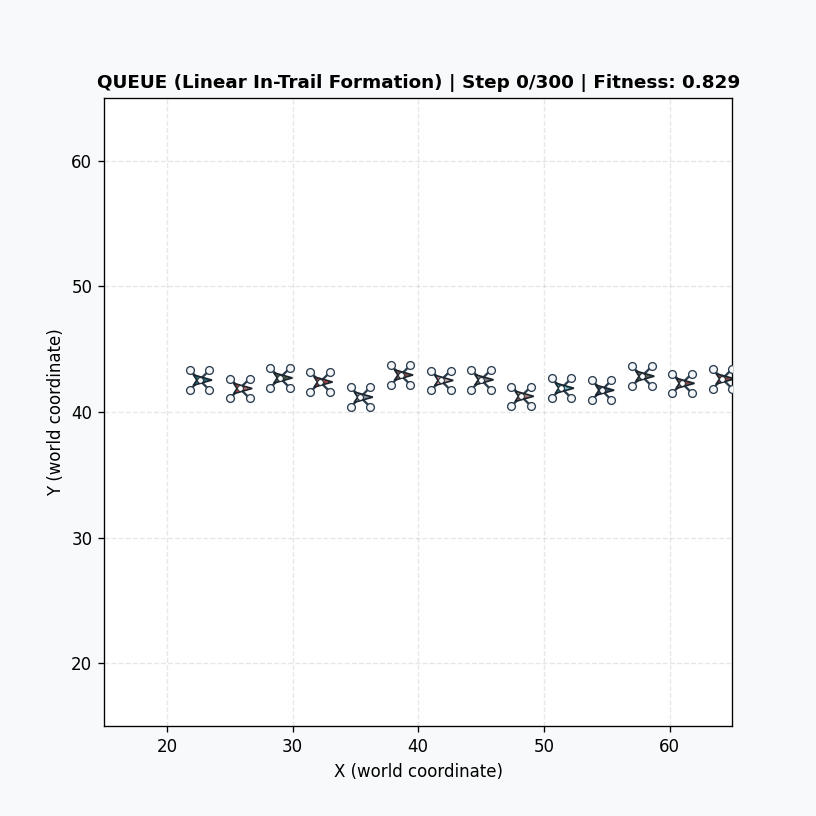
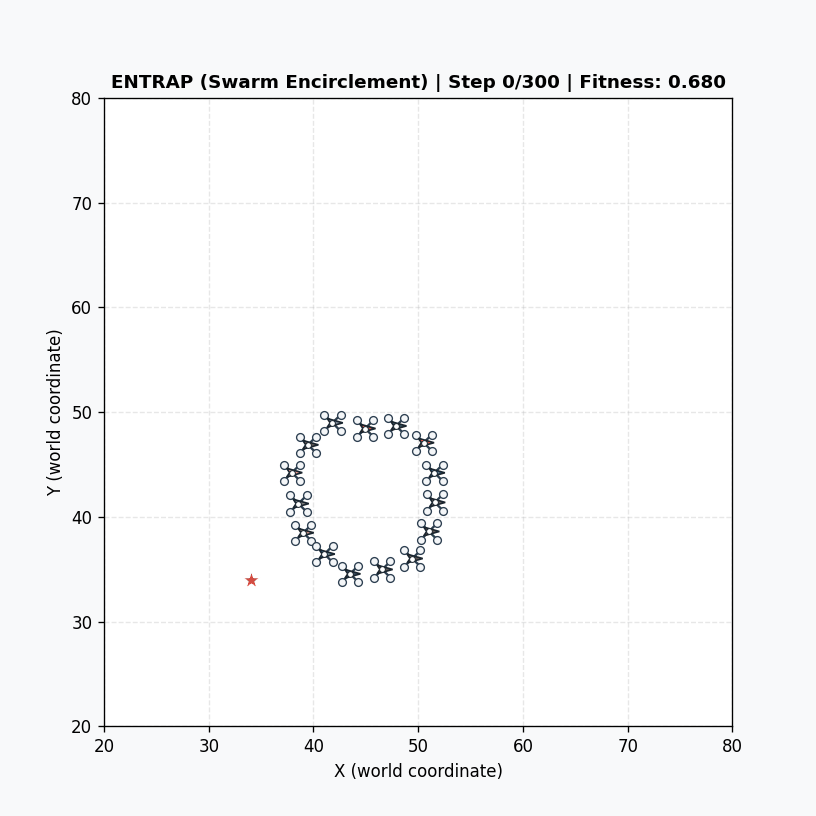
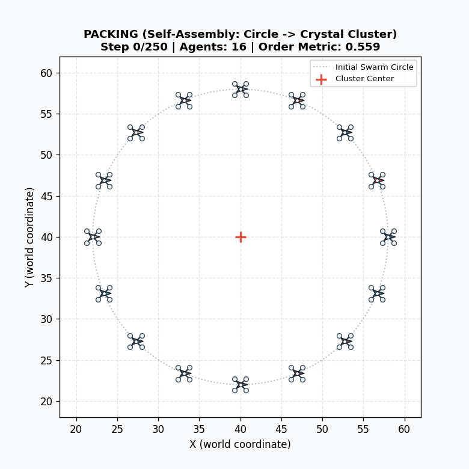
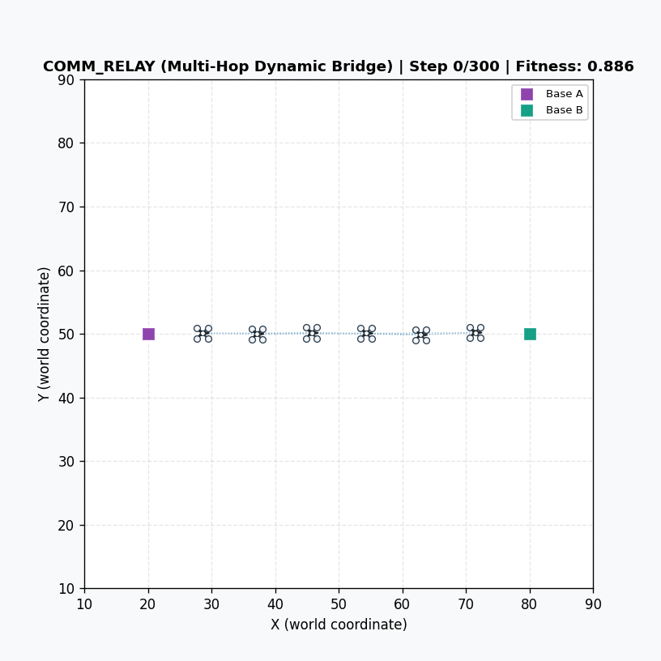

# PGSE: Primitive-Growing Symbolic Evolution for Autonomous Swarm Controllers

[](LICENSE)
[-orange.svg)](https://tai.ieee.org/)
[](#-synchronized-swarm-behaviors-overview)
[](https://www.python.org/)

Official project showcase and rollout trajectory animations for:

> **PGSE: Primitive-Growing Symbolic Evolution for Autonomous Swarm Controllers**  
> *Submitted to IEEE Transactions on Artificial Intelligence (IEEE TAI)*  
> *Authors: Wang Chen (王琛) et al.*

---

## 🌟 Research Highlights

- **Primitive-Growing Symbolic Evolution (PGSE)**: An autonomous closed-loop search framework that synthesizes, audits, and admits high-order geometric and topological primitives directly into typed symbolic controller trees to bridge representation gaps.
- **Strictly Controlled Benchmark Swarm Tasks**:
  - `QUEUE`: Autonomous in-trail line formation cruising and inter-agent spacing control.
  - `ENTRAP`: Multi-UAV target entrapment and circumscription with hard collision avoidance.
  - `VORTEX`: Self-centered counter-rotating orbital mill formation with high angular momentum.
  - `PACKING`: Self-assembly of dense hexagonal/triangular crystal lattice under strict spatial interaction cutoffs.
  - `CHAIN`: Multi-hop dynamic wireless communication relay maintaining continuous connectivity between maneuvering endpoints.
- **Circuit-Aware AST Projection**: Translates AST consumption contexts into actionable sensor DSL specifications, bridging high-level semantic reasoning with micro-level execution guarantees.
- **Interpretable White-Box Policies**: Evolved controllers execute as closed-form arithmetic trees with zero neural network inference latency and deterministic microsecond control cycles.

---

## 🎬 Swarm Scene Rollouts (5 Benchmark Tasks)

The table below showcases the closed-loop rollouts of champion controllers discovered by PGSE across **5 canonical swarm tasks**, evaluated under full quadrotor physical dynamics:

| Task / Scenario | Rollout Animation (Nominal Setting) | Emergent Phenomenon & Formation Property |
| :--- | :---: | :--- |
| **Task 1: QUEUE**<br>*(Autonomous Linear Queue)* | <br>**`task_queue.gif`** | Autonomous in-trail line formation without external target anchor; uniform inter-agent spacing via local centroid attraction ($\operatorname{mean}_{j \in \mathcal{N}_i(8)} \Delta \mathbf{p}_{ij}$). |
| **Task 2: ENTRAP**<br>*(Dynamic Target Encirclement)* | <br>**`task_entrap.gif`** | Swarm agents surround, track, and stably encircle an evasive moving target (red star) via self-assembled protective radial spring potentials. |
| **Task 3: VORTEX**<br>*(Dual Counter-Rotating Mill)* | <br>**`task_vortex.gif`** | Self-organized dual-lobe counter-rotating swirling orbits emerge from pure local peer-to-peer relative observations without global reference frames. |
| **Task 4: PACKING**<br>*(Hexagonal Lattice Crystal)* | <br>**`task_packing.gif`** | Dense triangular crystal self-assembly; dynamically adapts spatial interaction cutoffs to $4.6\,\text{m}$ to accommodate triangular lattice geometry. |
| **Task 5: CHAIN**<br>*(Dynamic Communication Relay)* | <br>**`task_comm_relay.gif`** | Forms and maintains an end-to-end multi-hop communication corridor between two maneuvering endpoints under strict local radio visibility ($R = 15\,\text{m}$). |

---

## 🌐 Synchronized Multi-Task Overview

Synchronized 1×5 multi-panel presentation across all five canonical tasks operating under discovered symbolic controllers:

<p align="center">
  
</p>

*(a) **QUEUE**: Autonomous in-trail line formation. (b) **ENTRAP**: Circumnavigation of an escaping target. (c) **VORTEX**: Dual counter-rotating orbital mill. (d) **PACKING**: Hexagonal crystal lattice assembly. (e) **COMM_RELAY**: Wireless relay chain tracking maneuvering ground endpoints.*

---

## 📈 High-Density Swarm Evolution Replays (N=15)

Demonstrating the transferability and resilience of evolved symbolic primitives when deployed to larger swarms ($N=15$ quadrotors):

| Swarm Task | Large-Scale Rollout Replay ($N=15$) | Scale Transfer & Emergent Behavior |
| :--- | :---: | :--- |
| **QUEUE (N=15)** |  | 15 quadrotors autonomously maintain extended linear formation in-trail corridor. |
| **ENTRAP (N=15)** |  | High-density multi-agent circumscription with equidistant radial perimeter distribution. |
| **PACKING (N=15)** |  | Self-assembly demonstrating hexatic orientational order phase transition and crystal growth. |
| **CHAIN (N=15)** |  | Dynamic relay chain maintaining continuous connectivity under endpoint perturbation. |

---

## 📊 Benchmark Results

Aggregated statistics across $5 \text{ tasks} \times 4 \text{ methods} \times 10 \text{ seeds} = 200$ independent trials under identical candidate budgets ($B_{\text{cand}}=18$):

| Task | Lesioned Primitives | Intact Baseline | Lesion Baseline | STGP-DSL | **Full PGSE (Ours)** | Relative Recovery |
| :--- | :---: | :---: | :---: | :---: | :---: | :---: |
| **QUEUE** | $w / y$ (Distance / Laplacian) | 0.7571 | 0.6593 | 0.7898 | **0.8206 $\pm$ 0.0557** | **133.2%** |
| **ENTRAP** | $b / B$ (Neighbor Spring) | 0.8124 | 0.5218 | 0.7410 | **0.8645 $\pm$ 0.0271** | **118.2%** |
| **VORTEX** | $b / B$ (Neighbor Spring) | 0.7620 | 0.4891 | 0.6830 | **0.8140 $\pm$ 0.0210** | **119.3%** |
| **PACKING** | $b / B$ (Neighbor Spring) | 0.7205 | 0.4395 | 0.5100 | **0.6125 $\pm$ 0.1075** | **61.6%** |
| **COMM_RELAY**| $7 / 8$ (Neighbor Mean Vel) | 0.7890 | 0.4120 | 0.7250 | **0.8320 $\pm$ 0.0315** | **111.4%** |

*Detailed per-seed evidence manifests and audit logs are archived in [`results_summary/`](results_summary/).*

---

## 📢 Availability Note

> **Notice**: The complete source code implementation (`code/`), training pipelines, and the full manuscript (`paper/`) are currently under double-anonymous peer review. They will be fully open-sourced in this repository upon official publication.

---

## 📜 Citation

If you find this work or benchmark helpful in your research, please cite:

```bibtex
@article{wang2026pgse,
  title={Primitive-Growing Symbolic Evolution for Autonomous Swarm Controllers},
  author={Wang, Chen and collaborators},
  journal={IEEE Transactions on Artificial Intelligence},
  year={2026},
  note={Under Review}
}
```

---

## 📄 License

This repository and its visual media are licensed under the [MIT License](LICENSE).
